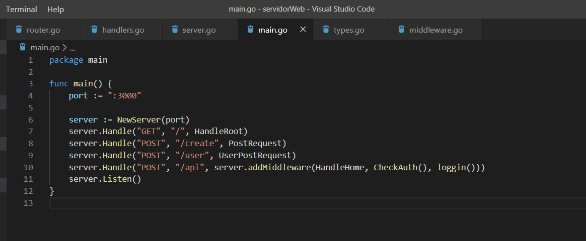
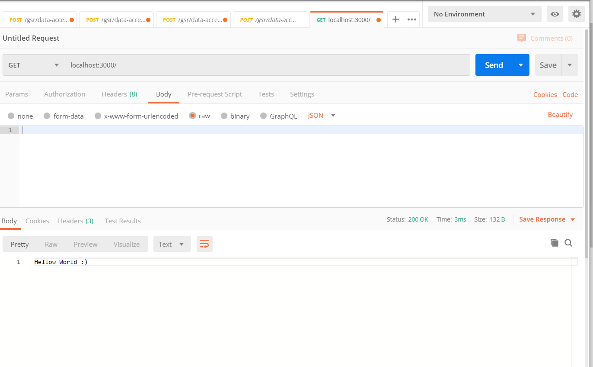
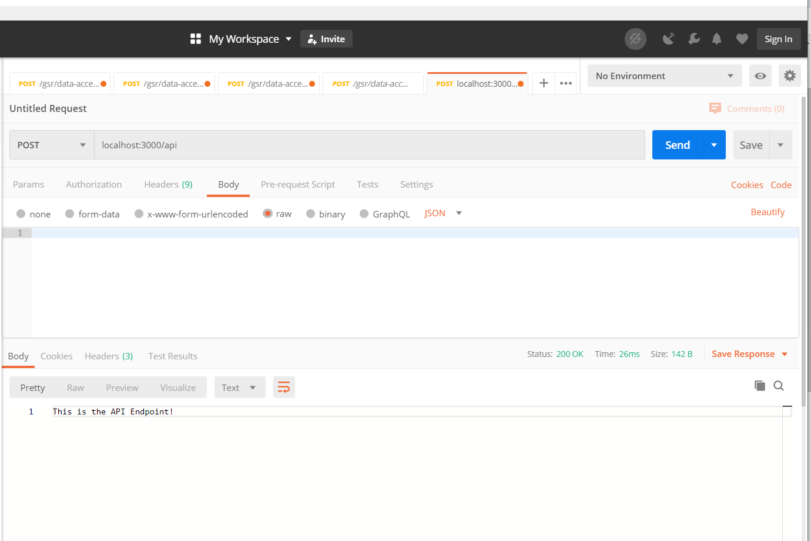
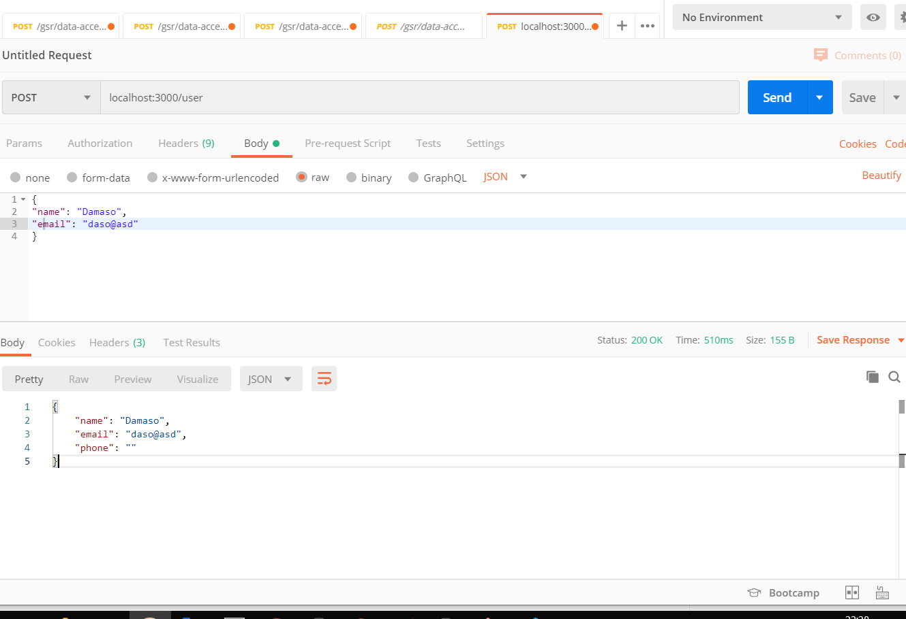

# WebServer

I have created a web server with go.!! :)

To do this, using a REST API we managed to create a client-server connection.

On this server we verify that the EndPoint is valid and that the Rest method that we generate
can be given on the corresponding route.

Here, you can see some of the path / methods that we have allowed

In addition we have several middleware to verify the good behavior of the transfer of client-server information:

1. We check the authentication of the user who wants to enter a certain path.

2. We check that the login was successful.

For testing it, we can use Postman or our Localhost:3000.

I show some examples of connectivity with Postman.

If you have any question, ask me!

Thanks and Regards!
